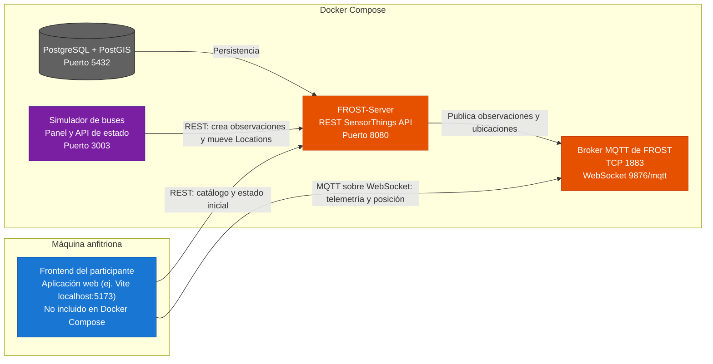

# Arquitectura del proyecto

El proyecto está compuesto por servicios ejecutándose en Docker Compose y un
frontend web desarrollado por los participantes del taller. El frontend consulta
**directamente** a FROST-Server: no existe ninguna capa intermedia (gateway) entre
ambos.

## Flujo de datos

1. El simulador de buses genera telemetría de los 4 buses eléctricos y la registra en FROST mediante REST: en cada ciclo publica observaciones de velocidad, batería y temperatura, y reasigna una `Location` nueva por bus.
2. FROST persiste los datos en PostgreSQL/PostGIS y publica los cambios en MQTT (observaciones y ubicaciones).
3. El frontend consume FROST **directamente**, sin intermediarios: REST para el catálogo y el estado inicial, y MQTT sobre WebSocket para lo continuo — telemetría (`Datastreams(<id>)/Observations`) y posición (colección `v1.1/Locations`).

## Puertos principales

| Servicio | Puerto | Uso |
|---|---:|---|
| Frontend | `5173` | Aplicación web del participante (ej. Vite); no está en Docker Compose |
| Simulador de buses | `3003` | Panel web y estado en `GET /api/status` |
| FROST REST | `8080` | API SensorThings `/FROST-Server/v1.1` |
| FROST MQTT | `1883` | MQTT TCP para servicios internos |
| FROST MQTT-WebSocket | `9876` | MQTT para navegadores en `/mqtt` |
| PostgreSQL/PostGIS | `5432` | Persistencia de FROST |

Las conexiones directas del navegador a FROST utilizan REST en el puerto `8080`
y MQTT sobre WebSocket en `ws://localhost:9876/mqtt`. El puerto MQTT TCP `1883`
se utiliza para las conexiones internas de Docker y no para el navegador.
